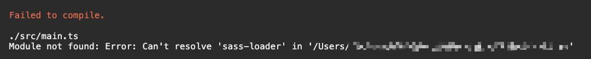
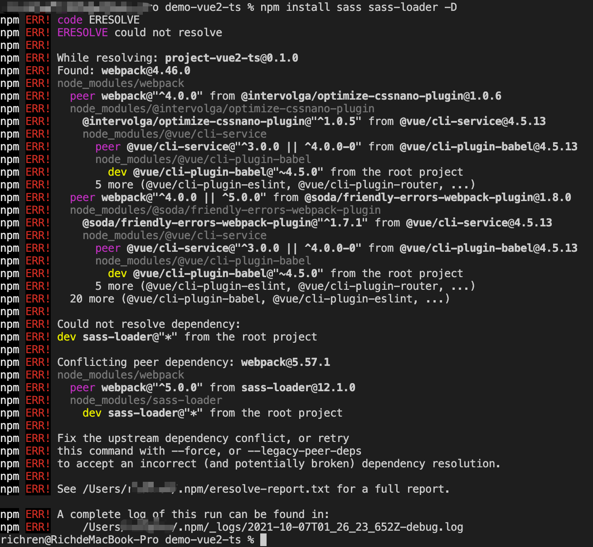

### Git

```
git init
git remote add origin https://gitee.com/richren/demo-vue-ts.git
git remote set-url --add origin git@github.com:richren364/demo-vue2-ts.git
```

### `@vue/cli`创建的项目添加路由

```
vue add router
```

### 添加 typescript 支持

#### 已存在的项目添加 ts 支持

```
vue add @type/typescript
```

自动安装 dependencies 和 devDependencies：

-   dependencies
    -   `vue-class-component`: 提供使用 class 语法写 vue 组件
    -   `vue-property-decorator`: 提供装饰器
-   devDependencies
    -   `@typescript-eslint/eslint-plugin`: 使用 eslint 校验 ts 代码
    -   `@typescript-eslint/parser`: 将 Typescript 转换为 AST 供 ESLint 校验使用
    -   `@vue/cli-plugin-typescript`: 使用 ts+ts-loader+fork-ts-checker-webpack-plugin 进行更快的类型检查
    -   `@vue/eslint-config-typescript`: 兼容 eslint 的 ts 校验规则
    -   `typescript`

#### typescript 常见配置

```json
{
    // 编译选项
    "compilerOptions": {
        "target": "esnext",
        "module": "esnext",
        "strict": true,
        "jsx": "preserve",
        "importHelpers": true,
        "moduleResolution": "node",
        "experimentalDecorators": true,
        "skipLibCheck": true,
        "esModuleInterop": true,
        "allowSyntheticDefaultImports": true,
        "sourceMap": true,
        "baseUrl": ".",
        "types": ["webpack-env"],
        "paths": {
            "@/*": ["src/*"]
        },
        "lib": ["esnext", "dom", "dom.iterable", "scripthost"]
    },
    "include": ["src/**/*.ts", "src/**/*.tsx", "src/**/*.vue", "tests/**/*.ts", "tests/**/*.tsx"],
    "exclude": ["node_modules"]
}
```

#### 其他相关文件说明

-   `src/shims-vue.d.ts`
-   `src/shims-tsx.d.ts`

### 代码规范

### demo1: eslint + standard

```js
module.exports = {
    root: true,
    env: {
        node: true
    },
    extends: {
        // eslint-plugin-vue
        'plugin:vue/essential',
        // @vue/eslint-config-standard
        '@vue/standard',
        '@vue/typescript/recommanded'
    },
    parserOptions: {
        ecmaVersion: 2020
    },
    rules: {
        'no-console': process.env.NODE_ENV === 'production' ? 'warn' : 'off',
        'no-debugger': process.env.NODE_ENV === 'production' ? 'warn' : 'off',
    }
}
```

#### demo2: eslint + prittier

-   eslint 配置文件
    ```js
    module.exports = {
        root: true,
        env: {
            node: true
        },
        extends: [
            // eslint-plugin-vue
            'plugin:vue/essential',
            'eslint:recommended',
            '@vue/typescript/recommended',
            // @vue/eslint-config-prettier
            '@vue/prettier',
            // @vue/eslint-config-typescript
            '@vue/prettier/@typescript-eslint'
        ],
        parserOptions: {
            ecmaVersion: 2020
        },
        rules: {
            'no-console': process.env.NODE_ENV === 'production' ? 'warn' : 'off',
            'no-debugger': process.env.NODE_ENV === 'production' ? 'warn' : 'off'
        }
    }
    ```
-   .pritterrc 配置文件
    ```json
    {
        "tabWidth": 2,
        "useTabs": true, // 使用tab（制表符）缩进而非空格
        "singleQuote": true, // 单引号
        "printWidth": 175, // 一行超过175个字符就换行
        "semi": false, // 是否在行尾加分号
        "trailingComma": "none", // 数组、对象最后一个元素的尾逗号
        "bracketSpacing": true, // 花括号前后空格
        "jsxBracketSameLine": false, // 使多行JSX元素最后一行末尾的 > 单独一行
        "arrowParens": "avoid", //只有一个参数的箭头函数的参数是否带圆括号（默认avoid不带）
        "htmlWhitespaceSensitivity": "ignore" //  HTML 文件空格敏感度
    }
    ```
-   vscode 配置文件

    ```json
    {
        "[html]": {
            "editor.defaultFormatter": "vscode.html-language-features"
        },
        "[javascript]": {
            "editor.formatOnSave": true,
            "editor.defaultFormatter": "esbenp.prettier-vscode"
        },
        "[vue]": {
            "editor.defaultFormatter": "octref.vetur"
        },
        "editor.codeActionsOnSave": {
            "source.fixAll": true
        }
    }
    ```

### 样式-SASS 支持

`https://cli.vuejs.org/zh/guide/css.html#%E5%BC%95%E7%94%A8%E9%9D%99%E6%80%81%E8%B5%84%E6%BA%90`


```sh
npm install sass sass-loader -D
npm install sass sass-loader@~10.2.0 -D
```


sass-loader peerDependencies 中 webpack 版本不一致

#### sass-loader 版本

-   releases

| sass-loader |            | Features                                              |
| ----------- | ---------- | ----------------------------------------------------- |
| v12.0.0     | 2021-06-01 | minimum supported Node.js version is 12.13.0          |
| v11.1.0     | 2021-05-10 | support node-sass v6 (dbbbdde)                        |
| v10.2.0     | 2021-05-10 | support node-sass v6 (dbbbdde)                        |
| v11.0.0     | 2021-02-05 | minimum supported webpack version is 5                |
| v10.1.0     | 2020-11-11 | allow the additionalData to be async (#902) (9d925ff) |

-   `peerDependencies`

| sass-loader version | webpack                      | node-sass              | sass              | fibers                | nodejs |
| ------------------- | ---------------------------- | ---------------------- | ----------------- | --------------------- | ------ |
| @^11.0.0,@^12.0.0   | "webpack": "^5.0.0"          |                        |                   |                       |        |
| @^10.0.0,@^9.0.0    | "webpack": "^4.36.0, ^5.0.0" |                        |                   |                       |        |
| @^8.0.0             | "webpack": "^4.36.0, ^5.0.0" | "node-sass"!: "^4.0.0" | "sass"!: "^1.3.0" | "fibers"!: ">= 3.1.0" |        |
| @^7.0.0             | "webpack": "^3.0.0, ^4.0.0"  |                        |                   |                       |        |

#### node 和 node-sass 版本对应关系

| Nodejs | node-sass version | node_modules |
| ------ | ----------------- | ------------ |
| 15     | 5.0+              | 88           |
| 14     | 4.14+             | 83           |
| 13     | 4.13+, 5.0-       | 79           |
| 12     | 4.12+             | 72           |
| 11     | 4.10+, 5.0-       | 67           |
| 10     | 4.9+              | 64           |

#### @cli/service 和 webpack 版本关系

#### 共享全局样式变量

`https://cli.vuejs.org/zh/guide/css.html#%E5%90%91%E9%A2%84%E5%A4%84%E7%90%86%E5%99%A8-loader-%E4%BC%A0%E9%80%92%E9%80%89%E9%A1%B9`
